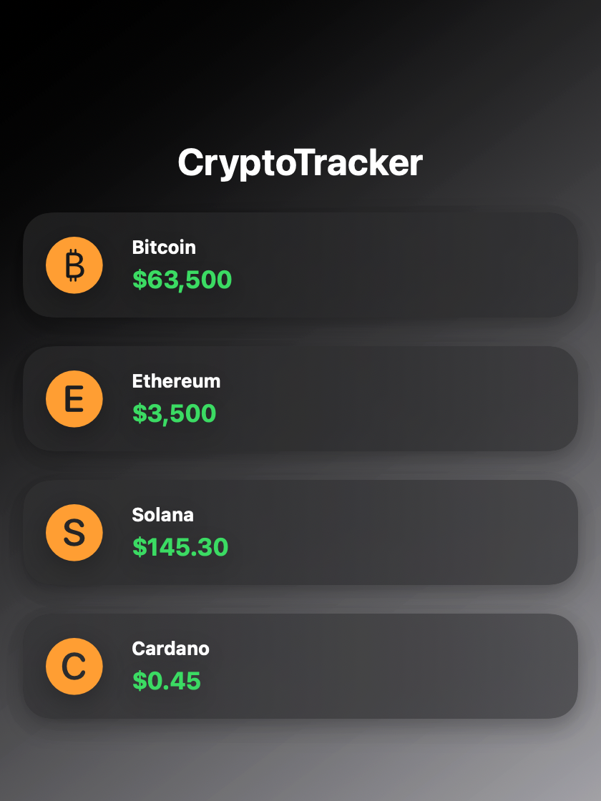

<div align="center">

# CryptoTracker

A small macOS app, built with SwiftUI, that lists crypto prices in a clean dark interface.




</div>

## What it is

A SwiftUI practice project: one screen that shows a few cryptocurrencies and their prices, built to get comfortable with how Apple's declarative UI works.

Right now it's a **UI prototype**. The prices are sample values written in the code, not live data. The interface, layout and data model are done, and connecting a real price API is the next step (see the roadmap below).

## What I learned building it

- **Declarative layouts** with `ZStack`, `VStack` and `HStack` instead of positioning views by hand.
- **Modeling data** with an `Identifiable` struct, so `ForEach` can render one card per coin.
- **Apple's visual language:** SF Symbols for the icons, a translucent `.ultraThinMaterial` for the cards, and shadows and gradients for depth.
- **Separating the model from the view**, so swapping sample data for API data only touches one place.

## Run it

You need a Mac with macOS Sonoma 14 or newer and the Swift toolchain (comes with Xcode or the Command Line Tools).

```bash
git clone https://github.com/Santi2307/CryptoTracker-Pro.git
cd CryptoTracker-Pro
swift run
```

To edit it with live previews, open the folder in Xcode (**File → Open…** and select `Package.swift`).

## How it's organized

```
Sources/CryptoTracker/
├── CryptoTrackerApp.swift   App entry point and window
└── ContentView.swift        The coin model, sample data and the list UI
docs/screenshot.png          Rendered straight from ContentView
```

## Roadmap

- [x] Dark UI with one card per coin
- [ ] Live prices from the CoinGecko API, refreshed every minute
- [ ] 24-hour change in green or red next to each price
- [ ] Price history chart with Swift Charts
- [ ] Choose which coins to follow (watchlist)
- [ ] iPhone version

---

<sub>Made by <a href="https://santi-portafolio.vercel.app">Santiago Delgado</a> · <a href="https://www.linkedin.com/in/santiagodelgado23/">LinkedIn</a></sub>
